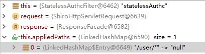

# shiro stateless
Demo of shiro session and stateless
安全框架shiro的一个同时支持无状态和session登录的添加部分自定义的demo

[完整demo项目github源码](https://github.com/t4Wang/shirostateless)

# 什么是shiro

 [官网地址](https://shiro.apache.org/)

`Shiro is a powerful and easy-to-use Java security framework that performs authentication, authorization, cryptography, and session management. With Shiro’s easy-to-understand API, you can quickly and easily secure any application – from the smallest mobile applications to the largest web and enterprise applications.`

shiro是一个java服务端控制访问权限的安全框架

# 使用场景
由于公司手机端不能存cookie，所以传统的session存储登录信息的登录方式（后面简称session登录）不能用，所以需要一个既支持session登录后访问有访问权限控制的url又支持无状态化夹带加密token访问有访问权限控制的url的shiro配置。

这个demo适合以下几类情形人员服用：

1. 面临上面我说的情况
2. 接触过shiro，接触过spring boot。但不知道具体shiro拦截的是怎么起到作用的
3. 接触过shiro，接触过spring boot。想把shiro 官方ini配置改写成java config配置的

这个demo不适合没有接触过shiro的人员，如果想要了解shiro基础的东西，推荐开涛的shiro的系列博客，地址
[开涛博客](https://jinnianshilongnian.iteye.com/blog/2018398) 你们看完后会发现我的一些代码也是参考他的。我开始用shiro也是先看文档后看开涛的博客然后又参考了一些别的博客，再自己打断点看shiro源码来摸索的。

# 使用加密token的原理

将前端的参数拼接成一条字符串，使用加密函数加密，将这个加密字符串作为请求签名和之前的参数一起发送到后端，后端收到参数后把请求签名剔除出来，剩下的参数采用和前端相同的加密函数加密，加密后的字符串和请求签名对比是否一样，如果一样服务端就认为这条请求是有效的，就继续放行判断对应的用户是否有权限访问

这样即使别人截获正常用户的请求想要做自己的不当用途，他的参数加密后和签名字符串不匹配的话访问就会失败，一定程度上的排除了恶意用户

为了增加安全性，可以选择加服务端提供的随机字符串和时间戳和其他参数同时加密，我只是在服务端加了随机字符串


# 要怎么改

原本shiro默认只支持session登录，不支持无状态形式的访问请求，访问服务器的时候如果没登录只能

首先在配置类中配置要纳入过滤范围的控制类
```java
    @Bean
    public ShiroFilterFactoryBean shiroFilter(DefaultWebSecurityManager securityManager) {

        ShiroFilterFactoryBean shiroFilterFactoryBean = new ShiroFilterFactoryBean();
        shiroFilterFactoryBean.setSecurityManager(securityManager);

        Map<String, Filter> filters = new HashMap();
        filters.put("statelessAuthc", statelessAuthcFilter());
        shiroFilterFactoryBean.setFilters(filters);

        shiroFilterFactoryBean.setLoginUrl("/login/sessionlogin");
        // 登录成功后要跳转的连接
        shiroFilterFactoryBean.setSuccessUrl("/test/unnauth");
        shiroFilterFactoryBean.setUnauthorizedUrl("/error");

        // 拦截器
        Map<String,String> filterChainDefinitionMap = new LinkedHashMap<>();

        //配置退出 过滤器,其中的具体的退出代码Shiro已经替我们实现了
        filterChainDefinitionMap.put("/login/logout", "logout");
        filterChainDefinitionMap.put("/css/**","anon");
        filterChainDefinitionMap.put("/js/**","anon");
        filterChainDefinitionMap.put("/img/**","anon");

        // 登录请求需要放行
        filterChainDefinitionMap.put("/login/sessionlogin", "anon");
        filterChainDefinitionMap.put("/login/statelesslogin", "anon");
        // 将想要纳入shiro statelessAuthc管理的放入map
        filterChainDefinitionMap.put("/user/*", "statelessAuthc");
        filterChainDefinitionMap.put("/**", "anon");
        shiroFilterFactoryBean.setFilterChainDefinitionMap(filterChainDefinitionMap);
        return shiroFilterFactoryBean;
    }
```
所有访问的请求都会被拦截并进入PathMatchingFilter preHandle，将放入filterChainDefinitionMap的pattern字符串取出和请求地址匹配。

接下来分别测试请求
1. 不在这个map里的请求地址
2. 在这个map里，过滤器anon（可以访问）的url
3. 在这个map里，自定义shiro过滤器statelessAuthc的url（不需要访问权限）
4. 在这个map里，自定义shiro过滤器statelessAuthc的url（需要访问权限）
5. session登录后访问不需要访问权限的请求
6. session登录后访问需要user权限的请求
7. 按自定义加密规则无状态化访问不需要访问权限的请求
8. 按自定义加密规则无状态化访问不需要访问权限的请求


有cookie记录登录状态的登录

1. 访问controller登录

2. controller根据传过来的参数判断身份

    账号密码登录
    构造UsernamePasswordToken,
    调用SecurityUtils.getSubject()获取subject
    调用subject.login(token)

3. UsernamePasswordRealm处理登录授权请求

    ModularRealmAuthenticator 遍历在 securityManager 注册的所有 realm ,调用 support 判断 Token 是否是支持的类型
    UsernamePasswordRealm 支持
    调用 UsernamePasswordRealm 的 doGetAuthenticationInfo 方法
    数据库查询账号密码，封装进info，返回，
    进入父类AuthenticationRealm assertCredentialsMatch方法info与token比对
    比对通过就通过校验

登录过后访问请求

先到达statelessAuthcFilter isAccessAllowed方法，直接返回false就会继续调用这个类的onAccessDenied方法，获取subject后判断登录过，就返回true，进入PathMatchingFilter preHandle，到达请求的方法

进入这个方法判断要不要进过滤器过滤
```java
protected boolean preHandle(ServletRequest request, ServletResponse response) throws Exception {

        if (this.appliedPaths == null || this.appliedPaths.isEmpty()) {
            if (log.isTraceEnabled()) {
                log.trace("appliedPaths property is null or empty.  This Filter will passthrough immediately.");
            }
            return true;
        }

        for (String path : this.appliedPaths.keySet()) {
            // If the path does match, then pass on to the subclass implementation for specific checks
            //(first match 'wins'):
            if (pathsMatch(path, request)) {
                log.trace("Current requestURI matches pattern '{}'.  Determining filter chain execution...", path);
                Object config = this.appliedPaths.get(path);
                return isFilterChainContinued(request, response, path, config);
            }
        }

        //no path matched, allow the request to go through:
        return true;
    }
```


